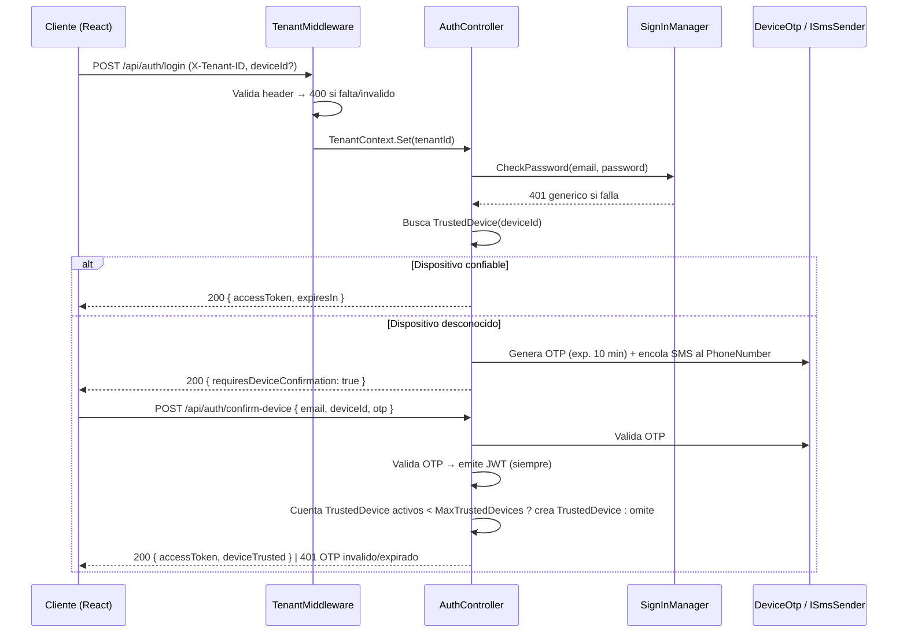

# Plan Técnico: Inventory Foundation

**Feature branch**: `001-inventory-foundation`
**Fuente**: diseño técnico SDD original (contenido íntegro, reformateado a Spec Kit)
**Spec de referencia**: [`spec.md`](./spec.md) — FR-001 … FR-015, NFR-001 … NFR-010

---

## Enfoque Técnico

Levantar el monorepo en un solo slice: Clean Architecture .NET 9 con CQRS/MediatR, aislamiento de tenant por fila (EF filter + RLS como defensa en profundidad), Identity+JWT con dispositivos confiables, y frontend React 19 feature-based.

FEFO queda **DIFERIDO** (slice 2): el modelo de este plan sólo deja el índice `(ProductId, ExpirationDate)` que lo soportará (NFR-009).

## Decisiones de Arquitectura

| Decisión | Elección | Alternativas rechazadas | Rationale |
|---|---|---|---|
| Batch como AR | AR separado de `Product` | `Batch` embebido en el agregado `Product` | Evita locks en contención de ajuste y habilita FEFO futuro |
| Concurrencia Batch | `xmin` + interceptor retry ×1 | ETag string, Timestamp varbinary | `xmin` es nativo de PostgreSQL; los reintentos viven en `TransactionBehaviour` |
| Auth timing | Identity ANTES de Application | Retrofit post-scaffold | Exploración: el retrofit de auth es costoso |
| RLS además de EF filter | Defensa en profundidad | Sólo EF filter | Mitiga el filtro olvidado en una entidad nueva |
| SKU automático | Secuencia per-tenant `SKU-{n}` | GUID, barcode-driven | Estable e inmutable cuando falta `Barcode` |
| Semaforización | Computada en query (`BatchStatusCalculator`) | Persistida y recalculada | Spec: no persistir; umbrales por tenant en `TenantSettings` |
| Repos vs DbContext | `IProductRepository`, `IBatchRepository` explícitos | `DbContext` directo en handlers | Testabilidad de reglas de negocio; los handlers CQRS los consumen |

## 1. Clean Architecture

```
┌─────────────────────────────────────────────────┐
│ Api (Controllers, TenantMiddleware, ProblemDetails)
├─────────────────────────────────────────────────┤
│ Application (Commands/Queries MediatR, Validadores,
│   Pipeline: Validation→Tenant→Transaction→Audit)
├─────────────────────────────────────────────────┤
│ Domain (Product, Batch, IProductRepository,
│   IBatchRepository, BatchStatusCalculator)
├─────────────────────────────────────────────────┤
│ Infrastructure (StockmaDbContext, Repos,
│   JwtTokenService, SmsOtpSender, Hangfire)
└─────────────────────────────────────────────────┘
Worker: Hangfire host (misma infra DI)
```

## 2. Modelo de Dominio

Detalle de campos, invariantes e índices en [`data-model.md`](./data-model.md).

- `Product : ITenantEntity, IAggregateRoot` — `Sku` (inmutable), `Barcode?`, `Name`, `Category` (enum: `Medication` / `Supplement` / `PersonalCare`), `ActiveIngredient?`, `Presentation?`, `StorageConditions?`, `Currency` (COP por defecto)
- `Batch : ITenantEntity, IAggregateRoot` — `ProductId`, `LotNumber`, `ExpirationDate`, `CurrentQuantity`, `LocationShelf`, `Status` (enum: `Active` / `Depleted` / `Expired`)
- VO `SemaphoreColor` = `Green` | `Yellow` | `Red` | `Expired`; `BatchStatusCalculator` (domain service) usa `TenantSettings.Thresholds { GreenMonths, YellowMonths }`, defaults 6/3
- `ApplicationUser : IdentityUser` + `TenantId`, relación con `DeviceFingerprint`
- `TrustedDevice : ITenantEntity` — `UserId`, `DeviceId`, `Fingerprint`, `TrustedAt`, `RevokedAt?`
- `TenantSettings : ITenantEntity` — `MaxTrustedDevices` (def. 2), `ExpiryThresholds`
- Interfaces: `IProductRepository` (`Add`, `Update`, `GetByBarcode`, `Search` por nombre), `IBatchRepository` (`Add`, `GetById`, `Adjust` con reintento), `IUnitOfWork` (rollback/redo en `AdjustBatch`)

## 3. DbContext + EF Core

`StockmaDbContext` (Infrastructure):

- `ApplyTenantFilters()` reflectivo: itera las entidades que implementan `ITenantEntity` y aplica `HasQueryFilter(e => e.TenantId == _tenantContext.TenantId)`. El test de arquitectura obliga la implementación (FR-002).
- Guard en `OnModelCreating`: `Product` unique `(TenantId, Sku)` y `(TenantId, Barcode)` cuando `Barcode` no es null; `Batch` FK `ProductId` + índice `(ProductId, ExpirationDate)`.
- `Batch.Configure`: `Property(p => p.Xmin).IsConcurrencyToken()` mapeado como shadow property; se usa `UseXminAsConcurrencyToken()` (FR-014).
- `TenantId` inmutable: en los handlers de `Update` NO se toca; el interceptor `AuditSaveChangesInterceptor` rechaza un `TenantId` modificado (throw) (FR-004).
- RLS (migración), con variable de sesión `app.tenant` (FR-003, NFR-003):
  - `ALTER TABLE products/batches/... ENABLE ROW LEVEL SECURITY;`
  - `CREATE POLICY tenant_isolation ON products USING (TenantId = current_setting('app.tenant')::uuid);`
  - Rol no-propietario `app_user`.

## 4. Middleware Tenant

Flujo `/api/*` (excepto el pass-through de rate limiting) — FR-001:

1. Lee el header `X-Tenant-ID` → `400` con `ProblemDetails` si está ausente o es inválido.
2. `Guid.Parse` + validación de GUID.
3. `TenantContext.Set(tenantId)` (`AsyncLocal`); binder con `ITenantContext` (scoped) usado por el interceptor y los repos.
4. Ejecuta `SET app.tenant = '{id}'` en la conexión de PostgreSQL (infra de reutilización de conexiones: `NpgsqlConnection` open → `ExecuteNonQuery`) por request-scope; RLS actúa como backstop.

## 5. Autenticación

### Flujo `POST /api/auth/login`

1. Rate limiting (5 intentos por IP por minuto vía `RateLimitingMiddleware`, `AspNetCore.RateLimiting`) — NFR-005.
2. `SignInManager.CheckPassword` → `401` genérico si falla (sin revelar qué factor falló) — FR-006.
3. Header `deviceId` opcional: si existe un `TrustedDevice` → emite JWT (claims `sub`, `tid`, `exp` ≤ 60 min) — NFR-004.
4. Si el dispositivo es desconocido → genera OTP (`IPasswordHasher` random, expira en 10 min, persistido en una fila `DeviceOtp`), encola el **SMS** al `ApplicationUser.PhoneNumber` vía `ISmsSender` y responde `{ requiresDeviceConfirmation: true }` — FR-008. `[PENDIENTE: usuario sin PhoneNumber cargado — definir si el primer login se permite sin 2FA, si el admin debe cargar el número antes de habilitar la cuenta, o si se bloquea]`
5. `POST /api/auth/confirm-device` tiene **dos efectos separables**: (a) valida el OTP y emite el JWT — **siempre**, haya slot libre o no; (b) crea el `TrustedDevice` **sólo si** el conteo de activos (`RevokedAt IS NULL`) es `< MaxTrustedDevices` del tenant, y registra el evento de notificación al dispositivo trusted previo (la notificación real vía SignalR/email queda fuera de alcance). Sin slot libre responde `200` con `deviceTrusted: false`: el usuario **entra igual**, el dispositivo no queda recordado y hará OTP en cada login. El sistema NO DEBE revocar ningún dispositivo para hacer lugar — `RevokedAt` se setea SÓLO por acción manual de un admin.

`POST /api/auth/register` crea `ApplicationUser.TenantId` a partir del header — FR-005. El `email` sigue siendo el identificador de login; el `PhoneNumber` **no** se carga en el registro.

### `PhoneNumber`: sólo un admin lo escribe (FR-008)

- El OTP viaja por SMS al `ApplicationUser.PhoneNumber` de **cada usuario**.
- Único camino de escritura: `PUT /api/admin/users/{userId}/phone-number`, autorizado sólo para un admin del tenant. `[PENDIENTE: propuesto, no está en las fuentes originales]`
- ASP.NET Core Identity habilita la superficie self-service por defecto (`SetPhoneNumberAsync`, `ChangePhoneNumberAsync`, endpoints del Identity UI/API): hay que **cerrarla explícitamente** (T050), o el usuario podría desviar su propio segundo factor.

### Diagrama de secuencia — login desde dispositivo nuevo (FR-006 + FR-008)



### `MaxTrustedDevices` gobierna el 2FA, no el acceso

| Responsabilidad | Requerimiento | Regla |
|---|---|---|
| **Acceso** | FR-008 | CUALQUIER dispositivo entra vía OTP por SMS, **siempre**. El login NO DEBE bloquearse por límite de dispositivos |
| **Privilegio de saltear el 2FA** | FR-007 | Máximo `MaxTrustedDevices` (def. 2, configurable por tenant) dispositivos trusted activos. Alta manual por admin, **sin** revocación automática |

Consecuencias en la implementación:

- `confirm-device` nunca devuelve un error por límite de dispositivos: sin slot libre responde `200` con `deviceTrusted: false`.
- **Nadie es expulsado.** No hay selección del `TrustedDevice` "más antiguo"; el índice `(UserId, TrustedAt)` filtrado que lo soportaba se elimina (ver [`data-model.md`](./data-model.md)). El único acceso restante es contar los activos.
- La tarea T020 implementa el conteo y el efecto condicional (b), no una revocación. Ver [`contracts/auth-api.md`](./contracts/auth-api.md).

## 6. API Endpoints

Contratos completos en [`contracts/`](./contracts/).

| Verbo + ruta | Command/Query | DTO |
|---|---|---|
| `POST /api/auth/register` | `RegisterUserCommand` | `{ email, password }` → `201 { userId }` |
| `POST /api/auth/login` | `LoginCommand` | → `{ accessToken, expiresIn }` \| `requiresDeviceConfirmation` |
| `POST /api/auth/confirm-device` | `ConfirmDeviceCommand` | `{ email, deviceId, otp }` → `accessToken` |
| `PUT /api/admin/users/{userId}/phone-number` | `SetUserPhoneNumberCommand` | `{ phoneNumber }` → `200`; sólo admin del tenant `[PENDIENTE: propuesto]` |
| `POST /api/products` | `RegisterProductCommand` | `ProductCreate` → `ProductDto` (`201`) |
| `PUT /api/products/{id}` | `UpdateProductCommand` | SKU nuevo → `400` |
| `GET /api/products?query=&limit=20` | `SearchProductsQuery` | trigram `ILIKE` → `ProductDto[]` |
| `GET /api/products/by-barcode/{code}` | `GetProductByBarcodeQuery` | `404` si no hay match exacto |
| `POST /api/batches` | `RegisterBatchCommand` | valida FK `Product` → `201` |
| `POST /api/batches/{id}/adjust` | `AdjustBatchStockCommand` | `delta ≠ 0`; stock nuevo < 0 → `IUnitOfWork` rollback + rechazo con `422` |
| `GET /api/batches?productId=` | `GetBatchesQuery` | incluye `SemaphoreColor` computado |

Errores uniformes: `ProblemDetails` con `errorCode` (`PRODUCT_SKU_DUPLICATE` `409`, `BATCH_NEGATIVE_STOCK` `422`, `CONCURRENCY_CONFLICT` `409`).

> El ajuste que dejaría stock negativo responde **`422`** con `errorCode: BATCH_NEGATIVE_STOCK` y **rechazo total** del ajuste (nunca parcial). Ver [`contracts/batches-api.md`](./contracts/batches-api.md).

## 7. Frontend

```
frontend/web/src/
  app/ (router, providers)
  features/auth/ { LoginPage, RegisterPage, DeviceOtpForm, auth-store (Zustand) }
  features/inventory/ { ProductListPage, ProductForm, BatchList, BarcodeScanner (@zxing/browser) }
  shared/ { api-client (orval-generated), query-client, ui-kit }
```

- Keys de TanStack Query prefijadas: `['tenant', tenantId, 'products', ...]`; el logout resetea la cache.
- PWA manifest + dev certs HTTPS para el scanner.
- `api-client` generado desde `packages/contracts/openapi.json` vía orval.

## 8. Migraciones

- Migración única inicial `InitialSchema`: tablas Identity + `TrustedDevices` + `Products` + `Batches` + `TenantSettings` + índices + políticas RLS + rol `app_user` no-propietario.
- Patrón: migraciones tenant-wide (una DB compartida, filtrado lógico); el seed de `TenantSettings` en onboarding queda fuera de este slice (INSERT manual inicial del admin-tenant).
- Arranque: `docker compose up postgres` → `dotnet ef database update` desde `backend/src/Infrastructure`.

## 9. Configuración

- `appsettings.json`: `ConnectionStrings`, `Jwt { Issuer, Audience, Key, ExpiresMinutes: 60 }`, `Sms { Provider, ApiKey, Sender }`, Hangfire PG, `Tenant:ExpiryThresholds` defaults.
- `Sms { Provider, ApiKey, Sender }` alimenta `SmsOtpSender` (implementación de `ISmsSender`). En dev, sender de consola/log. `[PENDIENTE: proveedor de SMS no elegido]`
- Variables de entorno: `ConnectionStrings__StockmaDb`, `Jwt__Key`, `Sms__ApiKey`, `ASPNETCORE_ENVIRONMENT`.
- `ops/docker-compose.yml`: `postgres:16-alpine` + volumen; network `stockma`; healthcheck `pg_isready`.
- CI: `dotnet build`/`test` de los 4 proyectos de test; frontend `npm run build` / `npm run lint`.

## Archivos (principales)

| Archivo | Acción | Descripción |
|---|---|---|
| `backend/src/Domain/Products/Product.cs` | Crear | AR `Product` |
| `backend/src/Domain/Batches/Batch.cs` | Crear | AR `Batch` con `xmin` |
| `backend/src/Domain/Common/ITenantEntity.cs` | Crear | Contrato tenant |
| `backend/src/Domain/Batches/BatchStatusCalculator.cs` | Crear | Semaforización |
| `backend/src/Application/Products/Commands y Queries` | Crear | `Register` / `Update` / `Search` / `ByBarcode` |
| `backend/src/Application/Batches/…Adjust/Register` | Crear | Reintento `xmin` |
| `backend/src/Application/Common/Behaviours` | Crear | `Validation` / `Transaction` / `Audit` |
| `backend/src/Infrastructure/Persistence/StockmaDbContext.cs` | Crear | `ApplyTenantFilters`, `AuditInterceptor` |
| `backend/src/Infrastructure/Identity/*` | Crear | `JwtTokenService`, `TrustedDevices` |
| `backend/src/Infrastructure/Notifications/SmsOtpSender.cs` | Crear | `ISmsSender` — envío del OTP por SMS `[PENDIENTE: proveedor de SMS no elegido]` |
| `backend/src/Api/Middleware/TenantMiddleware.cs` | Crear | header → context → variable de sesión RLS |
| `backend/src/Api/Controllers` | Crear | `Auth`, `Products`, `Batches` |
| `backend/tests/Architecture.Tests/TenantArchitectureTests.cs` | Crear | Falla sin `ITenantEntity` |
| `backend/tests/Api.IntegrationTests/TenantIsolationTests.cs` | Crear | A no ve B |
| `frontend/web/src/features/(auth\|inventory)/**` | Crear | Scaffolding Vite + React 19 |
| `packages/contracts/openapi.json` | Crear | Generado desde Api; feed de orval |
| `ops/docker-compose.yml` | Crear | PostgreSQL |
| `.github/workflows/ci.yml` | Crear | build / lint / test |

## Estrategia de Testing

| Capa | Qué | Cómo |
|---|---|---|
| Unit | Domain: rechazo de stock negativo, semaforización | xUnit + FluentAssertions |
| Unit | Behaviours de Application; prefijo de SKU automático | Mocks de `IProductRepository` |
| Integración | Aislamiento de tenant EF + RLS | Testcontainers PostgreSQL, respuestas cross-tenant vacías |
| Arquitectura | `ITenantEntity` obligatorio | NetArchTest sobre la estructura |
| API | Auth login/OTP, CRUD de endpoints | `WebApplicationFactory` |
| E2E (manual) | Scanner de barcode en la PWA | Playwright mínimo |

## Migración / Rollout

Greenfield: recrear la DB de dev (drop + migrate). PRs encadenados por unidad de trabajo:

1. Scaffolding + CI
2. Domain + Infra tenant
3. Auth
4. Products
5. Batches
6. Frontend auth + inventory
7. Contracts + PWA

Detalle y grafo de dependencias en [`tasks.md`](./tasks.md).
